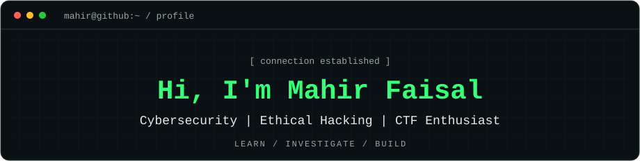
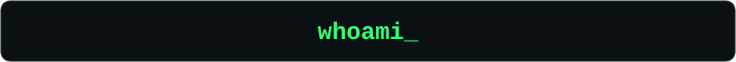
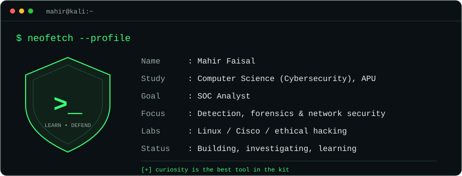
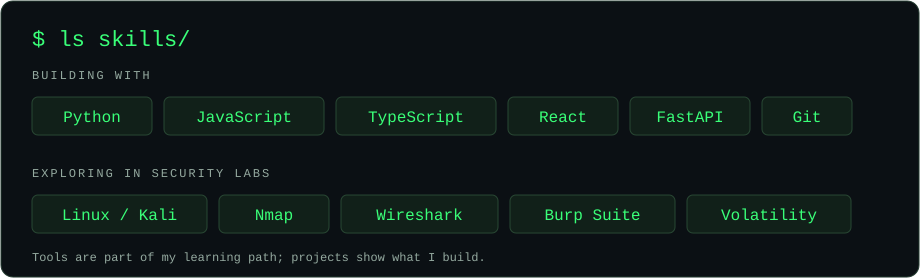
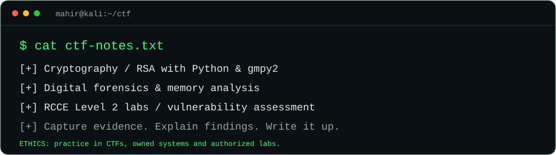
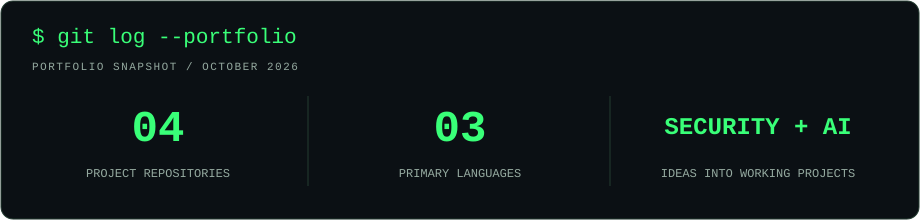
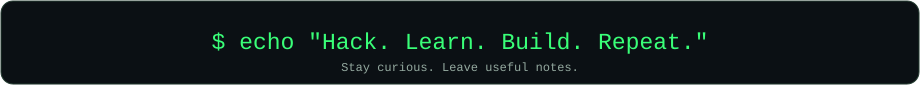

<!-- Profile graphics are stored in this repository for consistent rendering. -->

  
    
  
    
  
  
  
  

## `$ cat whoami.txt`

I'm a **Computer Science student specializing in Cybersecurity at Asia Pacific University (APU)**, working toward a career as a **SOC Analyst**. I enjoy investigating security evidence, understanding how attacks work, and building tools that make incidents easier to explain.

My work spans authentication monitoring, CTF cryptography, enterprise network design, Linux server administration, and AI applications. **AuthWatch** is my flagship security project; **Intelligent Recruiter** shows how I apply AI and software development in a team.

## `$ ls skills/`

| Area | Hands-on focus |
| :--- | :--- |
| **Security & investigation** | Authentication-log analysis, explainable detections, MITRE ATT&amp;CK mapping, digital forensics, vulnerability assessment |
| **Networking** | Cisco Packet Tracer, OSPF, HSRP, EtherChannel, VLANs, VLSM, DHCP, wireless networks |
| **Linux & infrastructure** | Rocky Linux, Ubuntu, BIND DNS, Apache, Postfix/Dovecot, SSL/TLS, VirtualBox |
| **Development** | Python, JavaScript, TypeScript, React, FastAPI, SQL/PostgreSQL, Git, GitHub Actions |

## `$ cat credentials.md`

Selected credentials and course-completion badges from my [public Credly wallet](https://www.credly.com/users/mahir-faisal.6c52c5e1/badges/credly):

| Credential / training | Issuer | Type |
| :--- | :--- | :--- |
| **Fortinet Certified Fundamentals Cybersecurity** | Fortinet | Certification |
| **Ethical Hacker · Endpoint Security** | Cisco | Training badges |
| **CCNA: Introduction to Networks · Switching, Routing, and Wireless Essentials** | Cisco | Course-completion badges |
| **Red Hat System Administration I (RH124) · II (RH134)** | Red Hat | Academy training |
| **Red Hat OpenShift Administration I (DO180)** | Red Hat | Academy training |
| **AWS Academy: Cloud Foundations · Data Engineering · Cloud Architecting · Generative AI Foundations** | AWS Training and Certification | Training badges |

[View all issued badges and credential details →](https://www.credly.com/users/mahir-faisal.6c52c5e1/badges/credly)

## `$ cat ctf-notes.txt`

- **CTFs & cryptography:** PUTCyberDays CTF 2026 participation, including RSA challenge work with Python and `gmpy2`.
- **Enterprise networking:** a four-branch Cisco Packet Tracer network with routing, redundancy, switching, wireless configuration, and address planning.
- **Linux administration:** a Rocky Linux / Ubuntu lab with DNS, mail, and web services secured with SSL/TLS.
- **Ethical hacking:** RCCE Level 2 lab work and a Juggybank penetration-testing coursework assessment.

## `$ ls projects/`

| Project | What I'm building | Stack |
| :--- | :--- | :--- |
| **[AuthWatch — Incident Cinema](https://github.com/Mahir-bit702/authwatch)** | Local authentication monitoring, explainable detections, and incident replays with MITRE ATT&amp;CK context. | Python · Windows event logs |
| **[Intelligent Recruiter](https://github.com/Mahir-bit702/intelligent-recruiter)** | An AI recruitment prototype with job parsing, candidate analysis, fairness checks, and ranking. Lead developer at AI Marathon 2026. | React · JavaScript · LLMs |
| **[Terra Climate Action Tracker](https://github.com/Mahir-bit702/terra-climate-action-tracker)** | A climate planning tool that turns an emissions baseline into a measurable 90-day action plan. | Python · FastAPI · Agents SDK |
| **[Vault — Campus Escrow](https://github.com/Mahir-bit702/campus-escrow-app)** | A campus marketplace escrow prototype with a React interface and a Sui Move contract. | TypeScript · React · Move |

## `$ git log --portfolio`

[Explore my repositories](https://github.com/Mahir-bit702?tab=repositories) · [See my contribution activity](https://github.com/Mahir-bit702#js-contribution-activity-description)

## `$ echo "let's connect"`

Interested in cybersecurity, CTFs, or building useful tools? Connect with me on [LinkedIn](https://www.linkedin.com/in/mahir-faisal-a0439a343/) or explore my work on [GitHub](https://github.com/Mahir-bit702).

  

