<!-- GitHub-compatible HTML with self-contained, accessible SVG artwork. -->

  
    
  
  
  
  

## `01 / whoami`

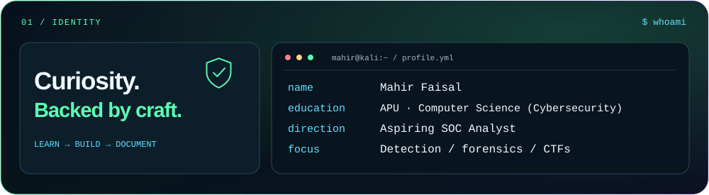

I'm a **Computer Science student specializing in Cybersecurity at APU**, working toward a career as a **SOC Analyst**. I investigate security evidence, study how attacks work, and build tools that make incidents easier to understand.

## `02 / selected work`

<a href="https://github.com/Mahir-bit702/authwatch">
  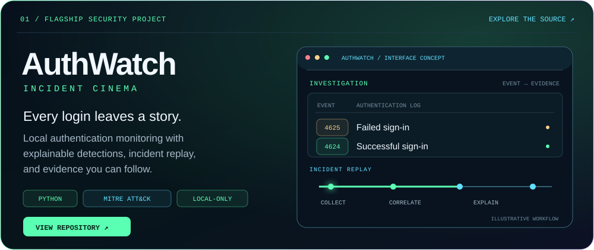
</a>

  <a href="https://github.com/Mahir-bit702/intelligent-recruiter">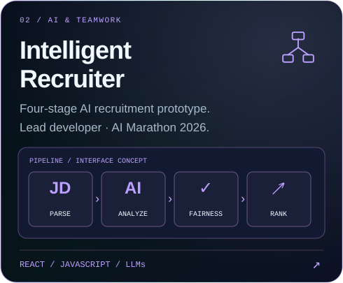</a>
  <a href="https://github.com/Mahir-bit702/terra-climate-action-tracker">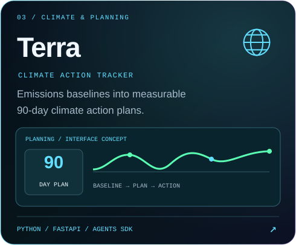</a>

<a href="https://github.com/Mahir-bit702/campus-escrow-app">
  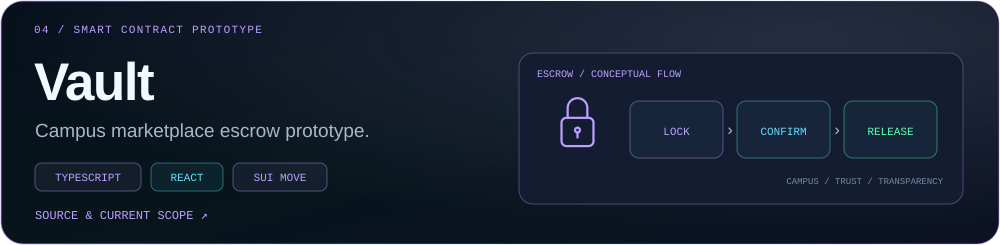
</a>

<strong>Read the project index</strong>

- **[AuthWatch — Incident Cinema](https://github.com/Mahir-bit702/authwatch):** local authentication monitoring, explainable detections, and incident replays with MITRE ATT&CK context.
- **[Intelligent Recruiter](https://github.com/Mahir-bit702/intelligent-recruiter):** job parsing, candidate analysis, fairness checks, and ranking; lead developer at AI Marathon 2026.
- **[Terra Climate Action Tracker](https://github.com/Mahir-bit702/terra-climate-action-tracker):** a climate planning tool that turns an emissions baseline into a measurable 90-day action plan.
- **[Vault — Campus Escrow](https://github.com/Mahir-bit702/campus-escrow-app):** a campus marketplace escrow prototype with a React interface and Sui Move contract.

## `03 / toolkit`

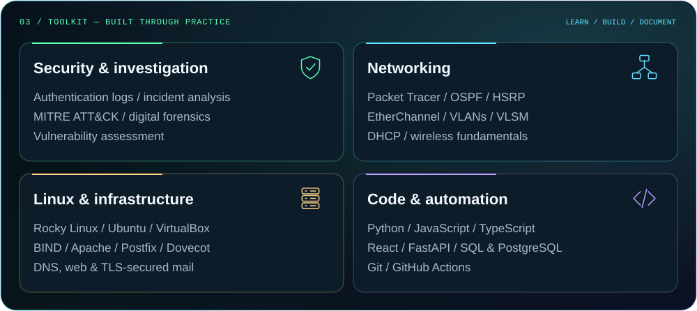

Security tools in my learning path: **Kali Linux · Nmap · Wireshark · Burp Suite · Volatility**.

## `04 / credentials & training`

<a href="https://www.credly.com/users/mahir-faisal.6c52c5e1/badges/credly">
  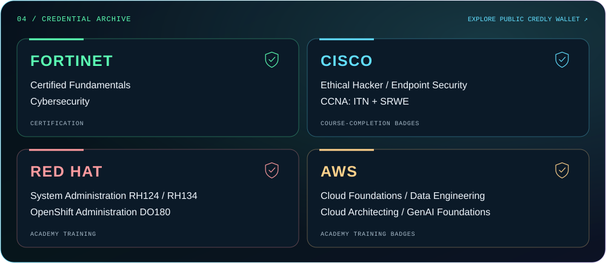
</a>

<strong>View credential names, issuers, and types</strong>

| Credential / training | Issuer | Type |
| :--- | :--- | :--- |
| **Fortinet Certified Fundamentals Cybersecurity** | Fortinet | Certification |
| **Ethical Hacker · Endpoint Security** | Cisco | Training badges |
| **CCNA: Introduction to Networks · Switching, Routing, and Wireless Essentials** | Cisco | Course-completion badges |
| **Red Hat System Administration I (RH124) · II (RH134)** | Red Hat | Academy training |
| **Red Hat OpenShift Administration I (DO180)** | Red Hat | Academy training |
| **AWS Academy: Cloud Foundations · Data Engineering · Cloud Architecting · Generative AI Foundations** | AWS Training and Certification | Training badges |

[View all issued badges and credential details →](https://www.credly.com/users/mahir-faisal.6c52c5e1/badges/credly)

## `05 / CTFs & labs`

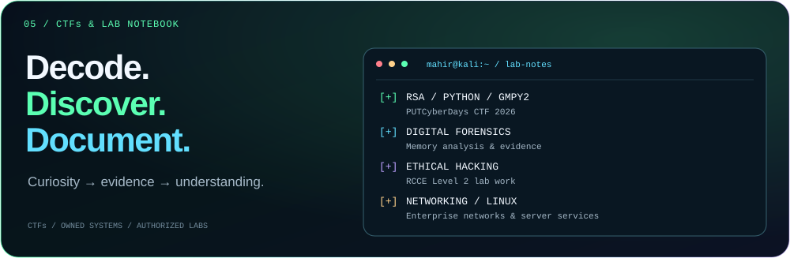

<strong>Open the lab notebook</strong>

- **CTFs & cryptography:** PUTCyberDays CTF 2026 participation, including RSA challenge work with Python and `gmpy2`.
- **Enterprise networking:** a four-branch Cisco Packet Tracer network with routing, redundancy, switching, wireless configuration, and address planning.
- **Linux administration:** a Rocky Linux / Ubuntu lab with DNS, mail, and web services secured with SSL/TLS.
- **Ethical hacking:** RCCE Level 2 lab work and a Juggybank penetration-testing coursework assessment.

 

<a href="https://github.com/Mahir-bit702?tab=repositories">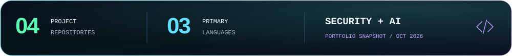</a>

[Explore my repositories](https://github.com/Mahir-bit702?tab=repositories) · [See my contribution activity](https://github.com/Mahir-bit702#js-contribution-activity-description)

<a href="https://www.linkedin.com/in/mahir-faisal-a0439a343/">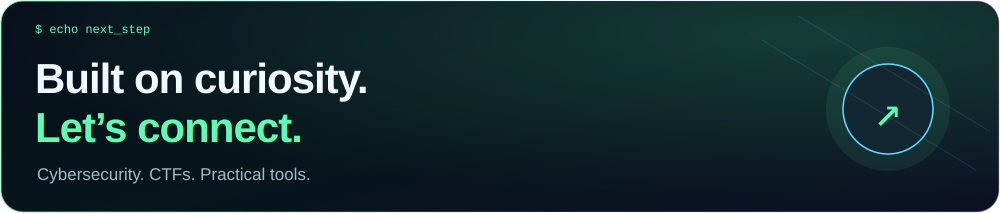</a>

  <a href="https://www.linkedin.com/in/mahir-faisal-a0439a343/">LinkedIn</a> &nbsp; / &nbsp;
  <a href="https://github.com/Mahir-bit702">GitHub</a> &nbsp; / &nbsp;
  <a href="https://www.credly.com/users/mahir-faisal.6c52c5e1/badges/credly">Credly</a>

